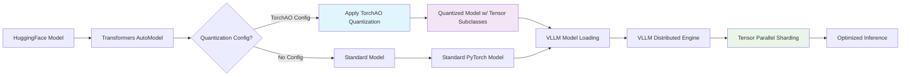
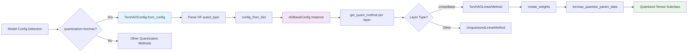
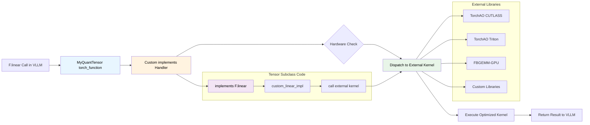

# TorchAO Integration with VLLM: Architecture and Usage Guide

This tutorial provides a comprehensive overview of how TorchAO integrates with VLLM, and what needs to be implemented to have a new technique work E2E.

## Table of Contents
* [Configuration System](#configuration-system)
* [Usage Examples](#usage-examples)
* [Supported Quantization Methods](#supported-quantization-methods)
* [Advanced Features](#advanced-features)
* [Performance Considerations](#performance-considerations)
* [Integration Architecture](#integration-architecture)


## Configuration System

### 1. HuggingFace Model Configuration

TorchAO quantization is configured through the model's `config.json` file:

```json
{
  "model_type": "llama",
  "quant_type": {
    "default": {
      "_type": "Int4WeightOnlyConfig",
      "_data": {
        "group_size": 128,
        "use_hqq": true
      }
    }
  }
}
```

### 2. TorchAO Configuration Classes

All quantization methods inherit from `AOBaseConfig`:

```python
from torchao.core.config import AOBaseConfig
from torchao.quantization import Int4WeightOnlyConfig

# Example configuration
config = Int4WeightOnlyConfig(
    group_size=128,
    use_hqq=True,
)
assert isinstance(config, AOBaseConfig)
```

### 3. Module-Level Configuration

For granular control, use `ModuleFqnToConfig`:

```python
from torchao.quantization import ModuleFqnToConfig, Int4WeightOnlyConfig, Int8WeightOnlyConfig

config = ModuleFqnToConfig({
    "model.layers.0.self_attn.q_proj": Int4WeightOnlyConfig(group_size=64),
    "model.layers.0.self_attn.k_proj": Int4WeightOnlyConfig(group_size=64),
    "model.layers.0.mlp.gate_proj": Int8WeightOnlyConfig(),
    "_default": Int4WeightOnlyConfig(group_size=128)  # Default for other modules
})
```

## Usage Examples

### 1. Quantizing Models with HuggingFace Integration

```python
from transformers import TorchAoConfig, AutoModelForCausalLM
from torchao.quantization import Int4WeightOnlyConfig

# Create quantization configuration
quantization_config = TorchAoConfig(
    quant_type=Int4WeightOnlyConfig(group_size=128, use_hqq=True)
)

# Load and automatically quantize the model
model = AutoModelForCausalLM.from_pretrained(
    "meta-llama/Llama-3.2-1B",
    torch_dtype="auto",
    device_map="auto",
    quantization_config=quantization_config
)

# Save quantized model
model.push_to_hub("your-username/Llama-3.2-1B-int4", safe_serialization=False)
```

### 2. Serving with VLLM

```bash
# Start VLLM server with TorchAO quantized model
vllm serve your-username/Llama-3.2-1B-int4 \
    --quantization torchao \
    --dtype bfloat16 \
```


## Adding New Quantization Methods to VLLM

### Minimal Requirements for VLLM Compatibility

To make a new TorchAO quantization method work with VLLM, you need to implement minimal tensor subclass operations that support **tensor parallelism**. VLLM uses `narrow()` and copy_ to move data from host cpu loaded in a state dict to the device, these  require these specific aten operations:

```python
@implements([aten.detach.default, aten.alias.default])
def _(func, types, args, kwargs):
    return return_and_correct_aliasing(
        func, args, kwargs, args[0]._apply_fn_to_data(func)
    )

@implements([aten._to_copy.default])
def _(func, types, args, kwargs):
    return return_and_correct_aliasing(
        func, args, kwargs, args[0]._apply_fn_to_data(torch.clone)
    )

@implements([aten.slice.Tensor])
def _(func, types, args, kwargs):
    # Handle slicing for tensor parallelism
    # Must preserve quantization parameters correctly
    pass
```

### Why these ?

VLLM's tensor parallelism works by:
1. **`narrow()`** - Slicing weight tensors across different dimensions
2. **Sharding** - Distributing tensor chunks across multiple GPUs
3. **`copy_()`** - Moving tensor data between devices
4. **`detach()`**


A helpful pattern for doing this is `_apply_fn_to_data`, a method that applies a given function to all the attributes on your class w/ Tensor types. Below is a generic implementation that should work for most subclasses. We make heavy use of this, you can see an examples in [mx_ops.py](../torchao/prototype/mx_formats/mx_ops.py):

```python
def _apply_fn_to_data(self, fn: Callable):
    """Applies a fn to all tensor components stored on this class"""
    tensor_names, ctx = self.__tensor_flatten__()

    # Apply the function to each tensor component
    new_tensors = {}
    for name in tensor_names:
        new_tensors[name] = fn(getattr(self, name))

    return self.__class__.__tensor_unflatten__(
        new_tensors,
        ctx,
        None,  # outer_size parameter
        None,  # outer_stride parameter
    )
```

## Step-by-Step Guide to Add a New Quantization Method

#### 1. Create Your Tensor Subclass

```python
from torchao.core.config import AOBaseConfig
from torchao.utils import TorchAOBaseTensor

@dataclass
class MyNewQuantConfig(AOBaseConfig):
    """Configuration for your new quantization method"""
    bits: int = 4
    group_size: int = 128
    VERSION: ClassVar[int] = 1

class MyQuantizedTensor(TorchAOBaseTensor):
    """Your tensor subclass inheriting from TorchAOBaseTensor"""

    def __new__(cls, tensor_impl, shape, dtype=None, requires_grad=False):
        return torch.Tensor._make_wrapper_subclass(
            cls, shape, dtype=dtype, requires_grad=requires_grad
        )

    def __tensor_flatten__(self):
        return ["tensor_impl"], [self.shape, self.dtype, self.requires_grad]

    @classmethod
    def __tensor_unflatten__(cls, tensor_data_dict, tensor_attributes, outer_size, outer_stride):
        tensor_impl = tensor_data_dict["tensor_impl"]
        shape, dtype, requires_grad = tensor_attributes
        return cls(tensor_impl, shape if outer_size is None else outer_size, dtype, requires_grad)
```

#### 2. Implement Required VLLM Operations

```python
from torch.utils._python_dispatch import return_and_correct_aliasing

@MyQuantizedTensor.implements([aten.detach.default, aten.alias.default])
def _(func, types, args, kwargs):
    return return_and_correct_aliasing(
        func, args, kwargs, args[0]._apply_fn_to_data(func)
    )

@MyQuantizedTensor.implements([aten._to_copy.default])
def _(func, types, args, kwargs):
    return return_and_correct_aliasing(
        func, args, kwargs, args[0]._apply_fn_to_data(torch.clone)
    )

@MyQuantizedTensor.implements([aten.slice.Tensor])
def _(func, types, args, kwargs):
    self, dim, start, end, step = fill_defaults(args, 5, [0, None, None, 1])
    if dim == 0:
        # Slice along batch dimension - apply to all tensor data
        return return_and_correct_aliasing(
            func, args, kwargs,
            args[0]._apply_fn_to_data(lambda x: aten.slice.Tensor(x, dim, start, end, step))
        )
    elif dim == 1:
        # Slice along feature dimension - need to handle quantization parameters
        # This is where tensor parallelism happens
        return MyQuantizedTensorImpl(
            aten.slice.Tensor(self.tensor_impl.quantized_data, dim, start, end, step),
            self.tensor_impl.scales,  # May need adjustment based on your quantization
            self.tensor_impl._layout,
        )
    else:
        raise NotImplementedError(f"Slicing along dim={dim} not supported")
```

#### 3. Register with TorchAO's Quantization System

```python
from torchao.quantization.transform_module import register_quantize_module_handler

@register_quantize_module_handler(MyNewQuantConfig)
def _my_quant_transform(module: torch.nn.Module, config: MyNewQuantConfig):
    """Transform function that applies your quantization to a module"""
    weight = module.weight

    # Your quantization logic here
    quantized_weight = my_quantization_function(weight, config)

    # Replace the weight with your quantized tensor
    module.weight = torch.nn.Parameter(quantized_weight, requires_grad=False)
    return module
```

### Key Implementation Details

#### Hardware-Specific Linear Operations
Your quantized tensor's forward pass determines hardware support and what actually gets called when F.Linear is called.

```python
@MyQuantizedTensor.implements(torch.nn.functional.linear)
def _(func, types, args, kwargs):
    input_tensor, weight_tensor, bias = args[0], args[1], args[2] if len(args) > 2 else None

    # This is where you define what hardware your method supports
    if hasattr(weight_tensor, 'use_cutlass_kernel'):
        return my_cutlass_linear(input_tensor, weight_tensor, bias)
    elif hasattr(weight_tensor, 'use_triton_kernel'):
        return my_triton_linear(input_tensor, weight_tensor, bias)
    else:
        # Fallback - dequantize and use standard linear
        return torch.nn.functional.linear(
            input_tensor, weight_tensor.dequantize(), bias
        )
```

#### Compilation Benefits
The overhead of tensor subclasses disappears with `torch.compile()`, this is on by default in VLLM:

```python
# Without compilation: subclass dispatch overhead
model = quantize_(model, MyNewQuantConfig())

# With compilation: optimized kernels, no dispatch overhead
model = torch.compile(quantize_(model, MyNewQuantConfig()))
```

### Trade Off of Tensor Subclasses
1. **Compilation**: is essential for removing subclass overhead. Without it unless your model is extremely gpu bound the overhead of dispatch on the CPU can severely impact performance.
2. The checkpoint defines the behavior of the model. You might be saying "don't all checkpoints do this". This is true, however people typically solely think of a torch.Tensor as its data. When in actuality its a true class where it brings the Dispatcher and all the kernels ATen has registered to it. When you define your tensor subclass, you are building a separate little world. One w/ a different representation of data, but also one where you need to explicitly define what ops you support and have implementations for all the hardware you want to support. This can feel a little like spooky action at a distance at first. But it can be very powerful. Case in point is being able to support TP with only 3 definitions.

## Serialization and Model Sharing

### SafeTensors Limitations

**Important**: TorchAO quantized models currently cannot be serialized with safetensors due to tensor subclass limitations. SafeTensors only supports plain tensors, but TorchAO uses tensor subclasses with additional metadata that cannot be directly serialized.

### Current Workaround

When saving quantized models to HuggingFace Hub, you **must** use `safe_serialization=False`:

```python
from transformers import TorchAoConfig, AutoModelForCausalLM
from torchao.quantization import Int4WeightOnlyConfig

# Quantize model
quantization_config = TorchAoConfig(Int4WeightOnlyConfig(group_size=128, use_hqq=True))
model = AutoModelForCausalLM.from_pretrained(
    "meta-llama/Llama-2-7b-hf",
    quantization_config=quantization_config
)

# REQUIRED: Must use safe_serialization=False for tensor subclasses
model.push_to_hub("your-username/llama-2-7b-int4", safe_serialization=False)
```

### The SafeTensors Challenge

The fundamental issue is that tensor subclasses contain:

1. **Multiple tensor components** (quantized data, scales, zero points)
2. **Non-tensor metadata** (layouts, configurations, function references)
3. **Complex reconstruction logic** that safetensors doesn't understand

### Potential Solutions (Future Work)

A proposed solution involves decomposing tensor subclasses for serialization:

```python
# Conceptual approach for future safetensors support
def decompose_for_safetensors(tensor_subclass):
    """Decompose tensor subclass into serializable components"""
    # Extract plain tensors
    plain_tensors = tensor_subclass.__tensor_flatten__()[0]

    # Extract metadata
    metadata = tensor_subclass.__tensor_flatten__()[1]

    # Serialize function references as strings
    serializable_metadata = {
        k: serialize_if_function(v) for k, v in metadata.items()
    }

    return plain_tensors, serializable_metadata

def reconstruct_from_safetensors(plain_tensors, metadata):
    """Reconstruct tensor subclass from safetensors"""
    # Deserialize function references
    deserialized_metadata = {
        k: deserialize_if_function(v) for k, v in metadata.items()
    }

    # Reconstruct tensor subclass
    return TensorSubclass.__tensor_unflatten__(
        plain_tensors, deserialized_metadata, None, None
    )
```

However this is not quite ready yet.

### Best Practices for Model Distribution

1. **For Production**: Use `safe_serialization=False` when pushing quantized models
2. **For Sharing**: Consider providing both quantized and unquantized versions
3. **For Loading**: VLLM automatically handles tensor subclass reconstruction during model loading

The TorchAO team is actively working on solutions to enable proper safetensors support for tensor subclasses.

## Integration Architecture Diagrams

### 1. High-Level Model Flow: Transformers → VLLM + TorchAO



### 2. TorchAO Integration Points in VLLM



### 3. Kernel Dispatch: Bringing External Kernels to VLLM


